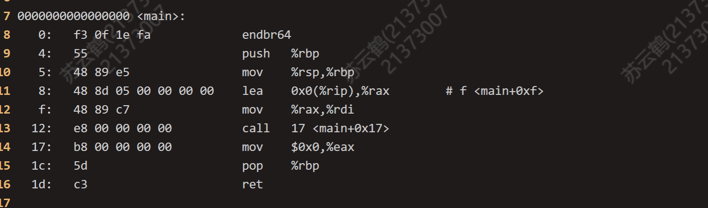
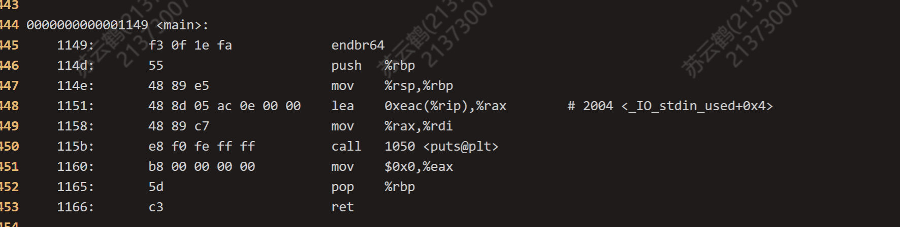
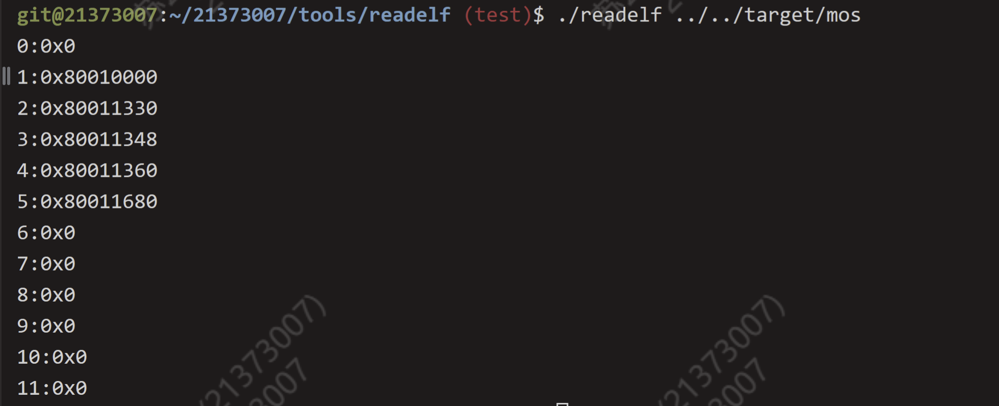
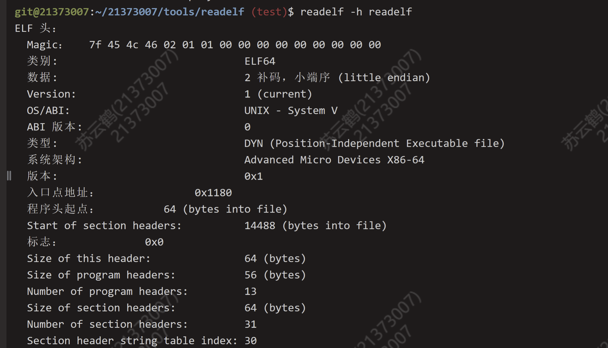
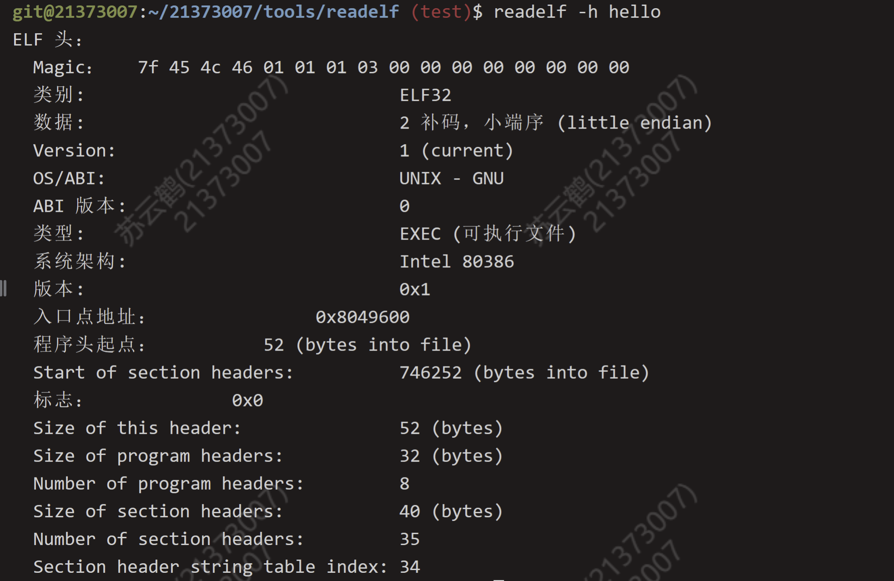
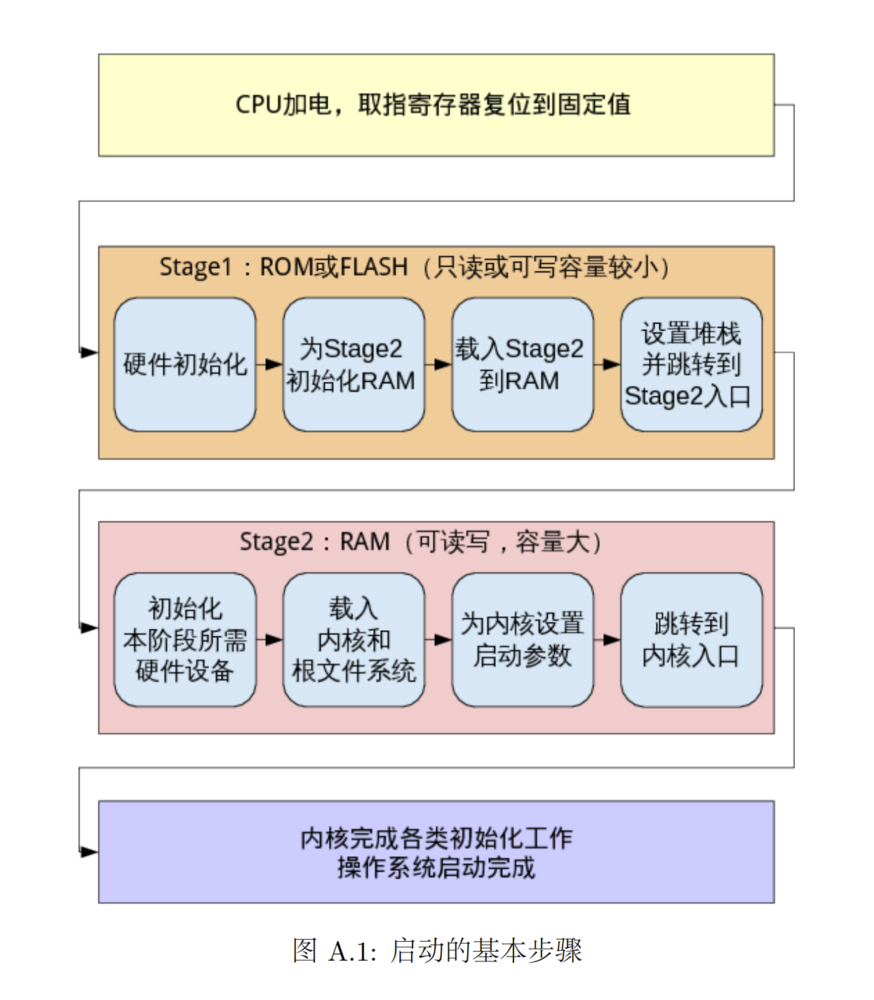

# 1. 思考题
## Thinking 1.1. 思考以下问题

> 请阅读附录中的编译链接详解，尝试分别使用实验环境中的原生 x86 工具链（gcc、ld、readelf、objdump 等）和 MIPS 交叉编译工具链（带有 mips-linux-gnu前缀），重复其中的编译和解析过程，观察相应的结果，并解释其中向 objdump 传入的参数的含义。

`objdump`命令是用查看目标文件或者可执行的目标文件的构成的gcc工具。使用`objdump -DS 要反汇编的目标文件名 > 导出文本文件名`指令，我们可以编译和链接过程中产生的目标文件反汇编成汇编语言，以便于分析编译链接的每步究竟做了什么。

首先，我们新建一个`helloworld.c`文件，其内容为：
```cpp
# include <stdio.h>
int main() {
	printf("Hello World!\n");
	return 0;
}
```

在这个程序中，我们引用了库函数`printf()`，但程序中并没有对这个函数的声明和定义。因此，在后续编译成可执行文件的过程中，必须把标准库和这个c程序编译到一起。

首先，我们执行`gcc -E helloworld.c > hello_e.txt`，发现产生了一个700余行的文件。其实就是C语言的预处理器将头文件的内容添加到了源文件中，但其中并没有`printf()`的定义。

接着，执行`gcc -c helloworld.c`，只编译而不链接，生成`helloworld.o`文件。对其进行反汇编，结果如图：


注意到，其中调用函数的一行指令：
```
12:   e8 00 00 00        call      17 <main+0x17>
```
里面本该填写 `printf` 地址的位置上被填写了一串 0。说明直到这一步，`printf` 的具体实现依然不在我们的程序中。

最后，执行`gcc -o helloworld helloworld.o`，编译出可执行文件`helloworld`，并将其反汇编，结果如图：


注意到，调用函数的一行指令变为：
```
115b:   e8 f0 fe ff ff        call      1050 <puts@plt>
```

可见`printf()`的具体地址已经被填入其中。由此推断， 
**`printf()` 的实现是在链接 (Link) 这一步骤中被插入到最终的可执行文件中的。**

---
## Thinking 1.2 思考下述问题：
> 1. 尝试使用我们编写的 readelf 程序，解析之前在 target 目录下生成的内核 ELF 文件。
> 2. 也许你会发现我们编写的 readelf 程序是不能解析 readelf 文件本身的，而我们刚才介绍的系统工具 readelf 则可以解析，这是为什么呢？（提示：尝试使用 readelf-h，并阅读 tools/readelf 目录下的Makefile，观察 readelf 与 hello 的不同）

1. 在`tools/readelf`目录下执行`./readelf ../../target/mos`，解析内核ELF文件，得到如下结果：


2. `readelf -h`指令可以显示ELF文件的文件头。分别执行`readelf -h readelf`和`readelf -h hello`，查看这两个可执行文件的文件头，得到如下结果：



注意到，这两个文件的文件类别有所区别。`hello` 是32位程序，而 `readelf` 是64位程序。我们自己编写的 readelf 程序在功能上做了简化，只能支持解析 ELF32 的程序，而不能解析 ELF64 的程序。这也就是为什么我们编写的 readelf 程序不能解析 readelf 文件本身。

事实上，目前Makefile文件中生成 hello 的命令是这样的：
```makefile
$(CC) $^ -o $@ -m32 -static -g
```

它指定了生成的可执行文件是32位的。如果把这个参数删去，生成的 hello 可执行文件是无法被我们自己编写的 readelf 文件解析的。

---
## Thinking 1.3 思考以下问题
> 在理论课上我们了解到，MIPS 体系结构上电时，启动入口地址为0xBFC00000（其实启动入口地址是根据具体型号而定的，由硬件逻辑确定，也有可能不是这个地址，但一定是一个确定的地址），但实验操作系统的内核入口并没有放在上电启动地址，而是按照内存布局图放置。思考为什么这样放置内核还能保证内核入口被正确跳转到？（提示：思考实验中启动过程的两阶段分别由谁执行。）

我们可以结合这张 MIPS 的启动过程来理解这个问题。


MIPS 体系结构上电的启动入口是 0xBFC00000。这个地址并不是内核需要被放置在的位置，而只是体系的启动入口。一般情况下，计算机系统刚上电时是没有正常的 C 语言环境，不能读取解析 ELF 文件。因此，设备上电后需要先找到这个地址，才可以通过 bootloader 的引导初始化硬件、RAM，并载入内核，为内核设置启动参数，并跳转到内核的入口。  

而我们的实验是在GXemul上完成的。GXemul 已经提供了 bootloader 的引导（启动）功能，并支持直接加载 ELF 格式的内核。因此我们不需要去找那个启动入口，而是可以跳过启动流程中的 stage1，直接将内核加载到到内存的对应地址，之后跳转到这个地址（内核的入口），启动就完成了。

---

# 2. 难点分析
## exercise 1.1
这道题是要我们输出一个ELF文件的所有所有节头的地址。本题核心是看懂`elf.h`文件定义的3个结构体，它们分别是ELF头，段头和节头的结构，包括入口地址，表项数、表项大小等。因此，这道题的思路就是通过 binary 找到节头表 sh_table，从中取出节头表数和节头表大小，通过循环打印出每个节头的地址即可。

---
## exercise 1.2
本题需要读懂include/mmu.h 中的内存布局图。找到 kseg0 中.text应该被放置在的地址，并依次将三个节放入即可。

---
## exercise 1.3
本题需要设置栈指针，并跳转到`mips_init`函数。栈指针的地址可以从内存布局图中找到。给sp指针赋一个地址值时，需要用到`la`指令。跳转指令只能是`j`而不能是`jal`。

---
## exercise 1.4
这道题是要自己实现一个打印函数`printk()`。**需要细心。。。**
**有几个注意点**：
1. 格式符`flag`中`0`和`-`是二选一的关系；
2. 

---

# 3. 实验体会
1. 初步掌握了操作系统启动过程的细节；
2. 进一步体会到了os实验的魅力~