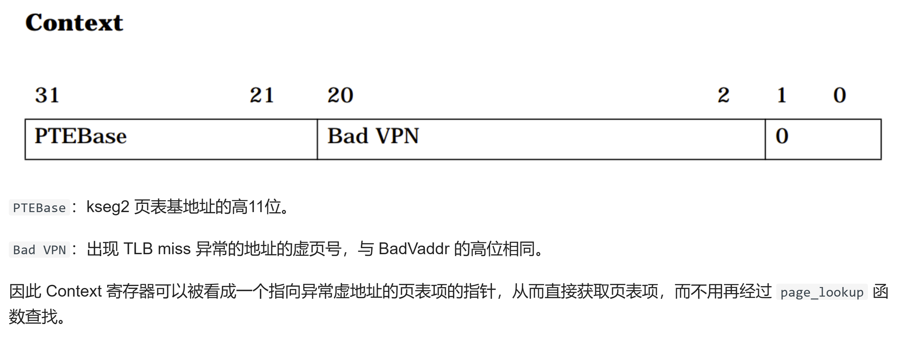

# Lab2 Challenge 实验报告

> 212114
> 21373007
> 苏云鹤

## 1. 实现思路

challenge2 需要实现 TLB 的快重填。为此，我们还需要将页表自映射到 kseg2 部分。

### Task 1. 
> 将页表映射到 kseg2 区域，实现从 kseg2 区域的虚地址访问页表。

实现页表的自映射是在初始化进程控制块的时候实现的，也就是`kern/env.c` 的`env_setup_vm()`函数。早在 Lab2 时，我们便将页表自映射到了 UVPT 处：  
```cpp
e->env_pgdir[PDX(UVPT)] = PADDR(e->env_pgdir) | PTE_V;
```  
**为什么在实现TLB快重填的时候，需要将同样的页表再映射一次，到 KSEG2 处呢？** 这是因为，当发生 TLB miss 异常时，Context 寄存器的 Bad VPN 段会被填入产生异常的虚拟页号。可以使用 Context 寄存器中保存的页表基地址（PTEBase）和异常地址的虚拟页号（Bad VPN）进行计算，以获取页表项的虚拟地址。具体的计算过程如下：
- 从 Context 寄存器中获取页表基地址（PTEBase）的高11位，这部分地址指示了页表的位置。
- 将页表基地址的高11位与异常地址的虚拟页号（Bad VPN）进行拼接，得到页表项的虚拟地址。
- 使用计算出的页表项的虚拟地址，CPU 可以直接访问对应的页表项，获取所需的信息。
这种计算过程是在**硬件层面实现**的。而 UVPT 是在 KUSEG 段，此段是无法实现虚拟地址和物理地址的线性转换，而需要遍历寻找。

因此，我们需要新增一行：
```cpp
e -> env_pgdir[PDX(UVPT)] = PADDR(e->env_pgdir) | PTE_V;
e -> env_pgdir[PDX(KSEG2)] = PADDR(e->env_pgdir) | PTE_V;
```

现在，便实现了将页表映射到 kseg2 区域。

### Task 2. 
> 正确设置 Context 寄存器。

实验指导书中介绍了 Context 寄存器的用法：  


在发生 TLB miss 时，产生异常的那个地址的虚页号会被存入 Context 寄存器。这为我们实现 TLB 的快速重填提供了便利。我们只需要在初始化时将 Context 寄存器中的高11位 (PTEBase) 设置成 KSEG2 的基地址。这样，在发生缺页中断时，我们便可以直接获取页表项，而不必通过 `page_lookup()` 进行便利查找了。    

我们只需要在 `init/start.S` 中添加如下代码：  
```cpp
	li  t0, 0xc0000000
	mtc0  t0, CP0_CONTEXT
```
即可通过 `mtc0` 指令为 `CP0_CONTEXT` 寄存器赋值为。  


### Task 3. 
> 在 TLB 重填特殊入口处实现 TLB 快速重填程序。

在 Lab2 中，我们曾在 `kernel.lds` 中设置了异常处理函数的入口：  
```cpp
= 0x80000000;
.tlb_miss_entry : {
    *(.text.tlb_miss_entry)
}

. = 0x80000080;
.exc_gen_entry : {
    *(.text.exc_gen_entry)
}
```
当发生用户态地址的 TLB Miss 异常时，会自动跳转到地址0x80000000 处，也就是 `tlb_miss_entry` 处。目前，我们的操作系统没有实现专门的缺页异常处理，而是会直接跳转到通用异常处理函数中：  
```cpp
// #include <asm/asm.h>
#include <stackframe.h>

.section .text.tlb_miss_entry
tlb_miss_entry:
	j       exc_gen_entry

.section .text.exc_gen_entry
exc_gen_entry:
	SAVE_ALL // 保存所有寄存器到 Trapframe 中
/* Exercise 3.9: Your code here. */
.section .text.exc_gen_entry
	mfc0 t0, CP0_CAUSE // 将 Cause 寄存器的内容拷贝到 t0 寄存器中
	andi t0, 0x7c   // 取得 Cause 寄存器中的异常码 
	lw t0, exception_handlers(t0) // 以异常码作为索引在 exception_handlers 数组中找到对应的中断处理函数
	jr t0  // 跳转到中断处理函数
```

现在，我们需要做的就是实现专门的TLB miss处理。在 R3000 手册中第六章的 Fast Kuseg refill form page table 部分给出了一个实现的例程：

仿照它，我们修改 `tlb_miss_entry:` 处的程序代码为：

```cpp
tlb_miss_entry:
	mfc0    k0, CP0_CONTEXT   
	mfc0    k1, CP0_EPC       
	lw      k0, 0(k0)
	nop     
	mtc0    k0, CP0_ENTRYLO0   
	nop
	tlbwr                     
	jr      k1                
	rfe
```
首先，我们需要记录协处理器 0 (Coprocessor 0) 的上下文寄存器 (Context Register) 和 EPC 寄存器中储存的值。前者储存着产生中断的页表项地址（位于 KSEG2 处），用`lw`指令将其取出。如果成功取出而没有再次发生 TLB miss 异常，那么我们便可以直接将其写入 CP0_ENTRYLO0 寄存器，并通过 `tlbwr` 指令写回 TLB，从而完成 TLB 的重填。如果这时又发生了 TLB miss(访问 KSEG2 处的页表引发的 tlb 缺失)，那么硬件会跳转至 `0x800000`处，执行通用异常处理程序。
```cpp
.section .text.exc_gen_entry
exc_gen_entry:
	SAVE_ALL                           # 保存所有寄存器到 Trapframe 中
/* Exercise 3.9: Your code here. */
.section .text.exc_gen_entry
	mfc0    t0, CP0_CAUSE             
	andi    t0, 0x7c                   
	li      t1, 0xc                   
	beq     t0, t1, flag               
	lw      t0, exception_handlers(t0) 
	jr      t0                        

flag: 
	mtc0    k1, CP0_EPC               
	lw      t0, exception_handlers(t0)  
	jr      t0                         
```
在这里，我们就需要将 CP0_CAUSE 中储存的异常码取出，从而判断应该分发到哪个具体的异常处理函数中。  

在发生二次重入时，还需要维护 CP0_EPC 的值，使得退出异常处理函数时，还能返回最初产生缺页中断的那个函数继续执行。因此，如果发生了中断，则需要将 k1 寄存器写回 EPC 寄存器。  

## 2. 测试程序
> 实现一个测试程序体现重填加速效果。测试程序本身及运行测试程序得到的运行结果应具有足够的可读性。

```cpp
# include <lib.h>

# define SIZE 4 * 1024 * 1024 // 开辟 4MB 的空间
# define STEP 4096   //  
# define LOOP 10000

int main() {
    char ch[SIZE];
    u_int start_s, start_us; // 用于计时的秒和毫秒
	u_int end_s, end_us;
    start_s = get_time(&start_us);

    for (int j = 0; j < LOOP; j++) {
        for (int i = 0; i < SIZE; i += STEP) {
            ch[i] = 1;
        }
    }

	end_s = get_time(&end_us);
	int time = ((int)(end_s) - (int)(start_s)) * 1000000 + (int)(end_us) - (int)(start_us);
    debugf("TLB重填花费时长:%u us\n", time);
    return 0;
}
```

一个页面大小 4KB，为了引发 TLB MISS，只需要在循环中以 4KB 为步长读写内存即可。  
为了计时，使用到了lab5-1课上实验所完成的 `get_time()` 函数。因此，需要在 `user/lib/ipc.c` 引入实现 `get_time()` 函数，并在 `user/include/lib.h` 添加对应的声明。  

## 3. 实验难点
首先，是关于页表自映射的问题。在 Lab2 时已经将页表自映射到了 UVPT 出处，此时又将页表自映射到 KSEG2 处。那么之前的映射还要保留吗？答案是要保留。否则，用户态进程将由于无权访问位于内核空间的 KSEG2，而导致访问不到页表。  
其次，是关于异常处理的问题。一开始并不清楚如何实现用户态进程触发 TLB miss 后快重填处理入口，而访问 KSEG2 页表再次发生 TLB miss 时，跳转到通用异常处理入口。后来在指导书中发现了这样的解释：  

可见硬件帮我们实现了跳转。
另外是关于 CONTEXT 寄存器的理解。 CONTEXT(R3000)前11位页表的高位，随后的19位为ENTRYLO记录的tlb缺失的页号，最后两位为全0。这就是tlb缺失的要填的页表记录的地址。发生 TLB miss 后，bad vpn 会被自动填充，因此我们只需要在初始化时修改高11位的地址即可，也就是 task2 干的事。  


