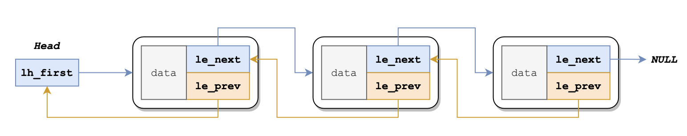

# BUAA-OS Lab2 实验报告

> 姓名：苏云鹤  
> 班级：212114  
> 学号：21373007  

## 1. 思考题

### Thinking 2.1. 
> 请根据上述说明，回答问题：在编写的 C 程序中，指针变量中存储的地址是虚拟地址，还是物理地址？MIPS 汇编程序中 lw 和 sw 使用的是虚拟地址，还是物理地址？ 

都是**虚拟地址**。

### Thinking 2.2. 
> 请思考下述两个问题：  
> • 从可重用性的角度，阐述用宏来实现链表的好处。  
> • 查看实验环境中的 /usr/include/sys/queue.h，了解其中单向链表与循环链表的实现，比较它们与本实验中使用的双向链表，分析三者在插入与删除操作上的性能差异。

1. 宏定义实现链表的最大好处，也是我认为最重要的好处是：可以**提高效率**。宏定义可以在编译时展开，避免了函数调用的开销。其余的好处都和函数类似，比如实现封装，使代码更简洁，也提高了可复用性等。

### Thinking 2.3.
> 请阅读 include/queue.h 以及 include/pmap.h, 将 Page_list 的结构梳理清楚，选择正确的展开结构。

**Page_list**是在`pmap.h`中通过调用`queue.h`的宏函数`LIST_HEAD()`定义的，具体来说，它是这么定义的：  
```cpp
LIST_HEAD(Page_list, Page);
```  
而`LIST_HEAD()`宏函数是这样的：
```cpp
#define LIST_HEAD(name, type)                
    struct name {
        struct type *lh_first;
    }
```

所以**Page_list**的定义可以被展开为：
```cpp
struct Page_list {
    struct Page *lh_first;
}
```

这里面包含一个指向`Page`结构体的指针`*lh_first`。`Page`结构体又是如何定义的呢？它被定义在`pamp.h`中，如下：  
```cpp
struct Page {
	Page_LIST_entry_t pp_link;
	u_short pp_ref;
};
```
里面包含一个`Page_LIST_entry_t`类型类型的结构体元素`pp_link`和一个`u_short`元素`pp_ref`。  

所以**Page_list**可以被继续展开为：
```cpp
struct Page_list {
    struct {
        Page_List_entry_t pp_link;
        u_short pp_ref;
    } *lh_first;
}
```
现在，这个二级结构中还存在着一个`Page_List_entry`类型的结构体。它的结构又是什么呢？注意到，它是在`pmap.h`中通过调用`LIST_ENTRY()`函数来定义的。  
```cpp
typedef LIST_ENTRY(Page) Page_LIST_entry_t;
```

`LIST_ENTRY()`也是在`queue.h`中定义的：
```cpp
#define LIST_ENTRY(type)   	
    struct{   
		struct type *le_next; 
		struct type **le_prev; 
	}
```

因此，`Page_LIST_entry_t`实际上是这样的：
```cpp
typedef struct {
    struct Page *le_next;
    struct Page **le_prev;
} Page_LIST_entry_t;

```

把它带入到**Page_list**中，得到其最详细的结构：
```cpp
struct Page_list {
    struct {
        struct {
            struct Page *le_next;
            struct Page **le_prev;
        } pp_link;
        u_short pp_ref;
    } *lh_first;
}
```
因此，**本题选C**。

> 注意，所有物理页面控制块是连续地存放在一个物理页面上的。因此，只要按顺序将它们与物理页面一一对应，就可以自然而然地建立映射关系。
> free_free_list中存的全都是控制块的地址，而不是控制块本身。


### Thinking 2.4
> 请思考下面两个问题：
> • 请阅读上面有关 R3000-TLB 的描述，从虚拟内存的实现角度，阐述 ASID 的必要性。  
> • 请阅读《IDT R30xx Family Software Reference Manual》的 Chapter 6，结合 ASID 段的位数，说明 R3000 中可容纳不同的地址空间的最大数量。  

1. `ASID` 是一种用来区分进程并保护它们的地址空间的标识符。在 MIPS 架构中，ASID 会出现在两个地方，一个是 TLB 的每个表项，表示该表项属于哪个进程，另一个是 `CP0_EntryHi` 寄存器，表示当前进程的 ASID。因此，进程在访问 TLB 时，如果虽然 VPN 匹配，但是表项不是 global 的，并且 ASID 和 CP0_EntryHi 的 ASID 不同，那么就会发生 TLB 缺失。 ASID 的另一个作用是让 TLB 能够同时存储多个进程的表项。如果 TLB 没有支持 ASID，那么每次切换页表（比如，在上下文切换时），TLB 就必须被清空或删除，以防止下一个进程使用错误的地址转换。有了 ASID，就可以避免每次进程切换都要清空 TLB。  
所以，ASID的必要性可以概括为：  
- ASID 可以提供地址空间的保护，防止一个进程访问或修改另一个进程的地址空间，从而保证了进程的隔离和安全。
- ASID 可以提高 TLB 的利用率，允许 TLB 同时存储多个进程的表项，从而减少了 TLB 缺失和替换的开销，提高了地址转换的效率。
- ASID 可以简化上下文切换的过程，避免了每次切换进程都要清空或刷新 TLB 的操作，从而节省了时间和资源，提高了系统的性能。

2. 根据《IDT R30xx Family Software Reference Manual》的第六章，R3000 中的 TLB 表项有 64 位，分为两个 32 位的字，分别是 EntryLo 和 EntryHi。  
**EntryLo 包含了以下的字段：**
   - PFN (Page Frame Number): 20 位，表示物理页号。
   - N (Non-Cacheable): 1 位，表示是否禁止缓存。
   - D (Dirty): 1 位，表示是否允许写入。
   - V (Valid): 1 位，表示是否有效。
   - G (Global): 1 位，表示是否全局。  
**EntryHi 包含了以下的字段：**
   - VPN (Virtual Page Number): 20 位，表示虚拟页号。
   - ASID (Address Space Identifier): 8 位，表示地址空间标识符。
可见，R3000 中的 ASID 段有 8 位，因此可以表示 0 到 255 的 256 个不同的值。这意味着 R3000 中可以容纳 256 个不同的地址空间，每个地址空间有 4GB 的虚拟地址范围。

### Thinking 2.5 
> 请回答下述三个问题：  
> • tlb_invalidate 和 tlb_out 的调用关系？  
> • 请用一句话概括 tlb_invalidate 的作用。  
> • 逐行解释 tlb_out 中的汇编代码。  

1. `tlb_invalidate()` 调用 `tlb_out()`。
2. `tlb_invalidate(asid, va)`可以使asid制定的进程对应页表中的这个虚拟地址对应的 TLB 项失效。
3. 如下：

```
LEAF(tlb_out)
.set noreorder
	mfc0    t0, CP0_ENTRYHI          # 将 CP0_ENTRYHI 中的值存入 t0 寄存器。
	mtc0    a0, CP0_ENTRYHI          # 将 a0 中的值写入 CP0_ENTRYHI
	nop
	/* Step 1: Use 'tlbp' to probe TLB entry */
	/* Exercise 2.8: Your code here. (1/2) */
	tlbp  # 根据 CP0_ENTRYHI 的值在 TLB 表中查找匹配的表项，并将其索引写入 Index 寄存器。如果没有匹配的表项，则将 Index 寄存器置为 -1
	nop
	/* Step 2: Fetch the probe result from CP0.Index */
	mfc0    t1, CP0_INDEX    # 将 CP0_INDEX 中的值存入 t1 寄存器。
.set reorder
	bltz    t1, NO_SUCH_ENTRY       # 比较 t1 是否小于 0 （与 -1 相等），等于 -1 则跳转。
.set noreorder
	mtc0    zero, CP0_ENTRYHI    # 将 CP0_ENTRYHI 清零
	mtc0    zero, CP0_ENTRYLO0    # 将 CP0_ENTRYLO0 清零
	nop
	/* Step 3: Use 'tlbwi' to write CP0.EntryHi/Lo into TLB at CP0.Index  */
	/* Exercise 2.8: Your code here. (2/2) */
	tlbwi  # 根据 Index 寄存器的值将 EntryLo 和 EntryHi 寄存器的值写入 TLB 表中的一个表项。
.set reorder

NO_SUCH_ENTRY:
	mtc0    t0, CP0_ENTRYHI    # 恢复原来的 EntryHi
	j       ra                 # 返回
END(tlb_out)

```

### Thinking 2.6. 
> 简单了解并叙述 X86 体系结构中的内存管理机制，比较 X86 和 MIPS 在内存管理上的区别。

**X86 体系结构**中的内存管理机制主要有两种方式，即**分段和分页**。  
**分段**是将内存划分为不同的段，每个段有一个起始地址、长度和属性，用一个64位的段描述符来表示。分段机制有 4 个主要部分：逻辑地址、段选择寄存器、段描述符和段描述符表。它的核心思想是：用段描述符来记录段的基地址、长度和各种属性。当程序用逻辑地址去访问内存的某个部分时，CPU 会根据逻辑地址里的段选择符在段描述符表里找到对应的段描述符。然后检查程序的访问是否合法，如果合法，就用段描述符里的基地址把逻辑地址转换成线性地址。  
**分页**是将内存划分为固定大小的页，每个页有一个线性地址和物理地址，用一个32位或64位的页表项来表示。分段和分页可以结合使用，将逻辑地址转换为线性地址，再转换为物理地址。  
  
**MIPS体系结构**中的内存管理机制主要是**分页**。MIPS没有分段的概念，只有线性地址和物理地址。MIPS使用TLB来缓存页表项，加速地址转换。MIPS还支持多种页面大小，从4KB到16MB不等。  

**X86和MIPS在内存管理上的区别主要有以下几点：**  
- X86支持分段和分页两种方式，而MIPS只支持分页一种方式；  
- X86使用描述符表来存储段描述符，而MIPS没有描述符表的概念；  
- X86使用多级页表来存储页表项，而MIPS使用TLB来缓存页表项；  
- X86的页面大小固定为4KB或4MB，而MIPS的页面大小可以变化从4KB到16MB。  
  
### Thinking A.1. 
> 在现代的 64 位系统中，提供了 64 位的字长，但实际上不是 64 位页式存储系统。假设在 64 位系统中采用三级页表机制，页面大小 4KB。由于 64 位系统中字长为 8B，且页目录也占用一页，因此页目录中有 512 个页目录项，因此每级页表都需要 9 位。
因此在 64 位系统下，总共需要 3 × 9 + 12 = 39 位就可以实现三级页表机制，并不需要 64位。
> 现考虑上述 39 位的三级页式存储系统，虚拟地址空间为 512 GB，若三级页表的基地址为 PT<sub>base</sub>，请计算：
> • 三级页表页目录的基地址。
> • 映射到页目录自身的页目录项（自映射）。

**三级页表页目录基地址**：  
$ PD_{base} = PT_{base} | PT_{base} >> 9 | PT_{base} >> 18 $

**映射到页目录的页目录项**：
$ PDE_{self} = PT_{base} | PT_{base} >> 9 | PT_{base} >> 18 | PT_{base} >> 27 $

---

## 2. 难点分析

### 2.1. Lab2 的整体思路
Lab2 所做的工作就是管理内存。exercise 2.1. ~ exercise 2.5. 是在实现物理内存的管理，exercise 2.6. ~ exercise 2.10. 是在实现虚拟内存的管理。  
其中，物理内存通过页控制块`Page`管理，虚拟内存通过两级页表管理。

### 2.2. 物理内存的管理——页控制块
这一部分最困难的就是理解双向链表是如何建立的，结构是什么，这样才能读懂和写出管理链表的宏函数。可以通过如下这张示意图加深对链表结构的理解：  
  
特别注意的是，`le_prev` 是一个指向指针的指针，它指向的是前一个节点的 `le_next` 指针，而不是前一个节点。

### 2.3. 虚拟内存的管理
这一部分最困扰我的就是各种虚拟地址和物理地址的关系以及它们是如何转化的。总的来说，虚拟地址一共有 4GB，其中包含 2GB 用户态和 2GB 内核态。处于内核态（kesg0、kesg1）的虚拟地址只需要高位抹0即可转化成对应的物理地址，这部分转化函数被定义成了若干宏函数；而处于用户态（kuseg）的虚拟地址需要查TLB中存放的两级页表实现转化。  
另外，需要特别注意的是，MIPS R3000 发出的地址均为虚拟地址，因此**如果程序想访问某个物理地址，需要通过映射到该物理地址的虚拟地址来访问**。

---

## 3. 实验体会
1. 初步掌握了操作系统管理内存的细节；
2. 进一步体会到了os实验的魅力~

另外，完成这次实验时明显感觉难度增大，主要是因为第一次做实验的时候对整体思路不够明确，不知道每一题在干什么。另外，这次实验让我感受到了C语言和数据结构基础牢固的重要性，尤其是对与指针和结构的理解和运用。  
对于物理地址和虚拟地址的理解，我思考了这个例子：  
这个函数会输出 `Hello mos`，原因如下：

- 首先，`unsigned int a[] = {0x6c6c6548, 0x0000206f}` 定义了一个无符号整型数组，其中每个元素占用 4 个字节，即 32 位。
- 然后，`(char *) a` 将数组的首地址转换为字符指针，即指向第一个元素的第一个字节。由于 C 语言中的字符占用 1 个字节，即 8 位，所以每次移动指针时，只会移动到下一个字节。
- 接着，`printf("%s%s\n", (char *) a, (char *) &magic)` 将两个字符指针作为参数传递给 `printf` 函数，并用 `%s` 格式化输出。这意味着 `printf` 函数会从指针所指向的地址开始，依次输出每个字节的内容，直到遇到 `\0` 结束符为止。
- 因此，`(char *) a` 指向的是 `0x6c6c6548` 的第一个字节，即 `0x48`。如果将其转换为 ASCII 码，就是字符 `H`。同理，接下来的三个字节分别是 `0x65`、`0x6c` 和 `0x6c`，对应的字符分别是 `e`、`l` 和 `l`。所以，输出的第一个字符串是 `Hell`。
- 接下来，`(char *) &magic` 指向的是变量 `magic` 的地址，即 `0x00736f6d` 的第一个字节，即 `0x6d`。如果将其转换为 ASCII 码，就是字符 `m`。同理，接下来的两个字节分别是 `0x6f` 和 `0x73`，对应的字符分别是 `o` 和 `s`。所以，输出的第二个字符串是 `mos`。
- 最后，在两个字符串之间有一个空格符 `0x20`，对应的字符是空格。所以，在输出时会有一个空格隔开两个字符串。因此，最终的输出结果是 `Hello mos\n`。