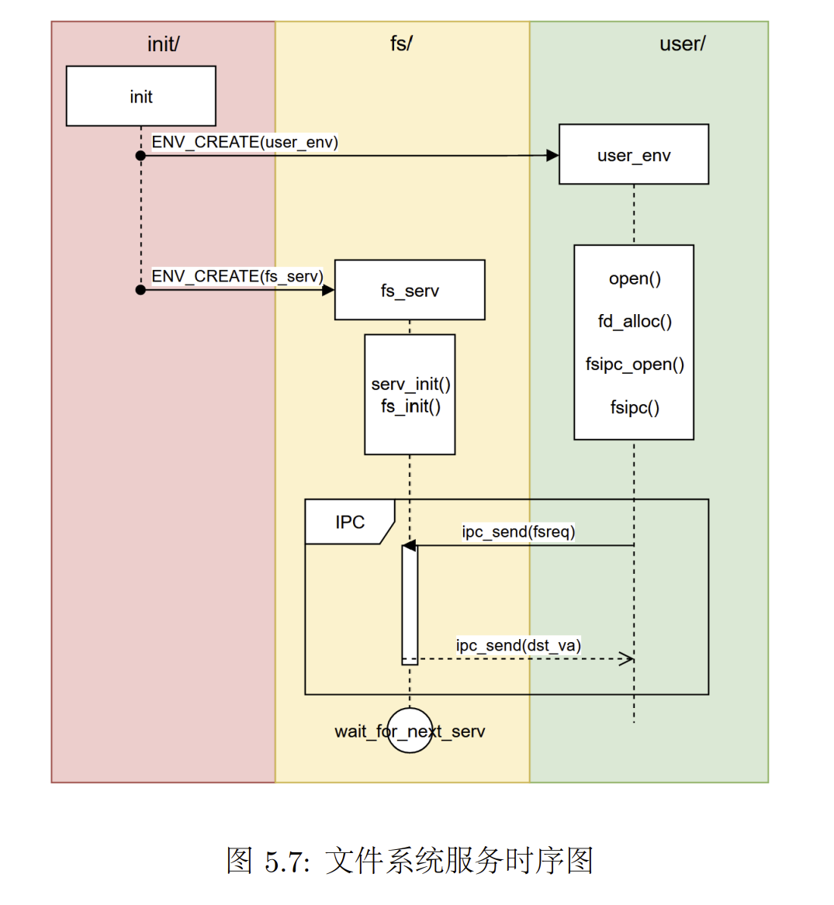

# BUAA-OS Lab5 实验报告

> 姓名：苏云鹤  
> 班级：212114  
> 学号：21373007  

## 1. 思考题

### Thinking 5.1. 
> 如果通过 kseg0 读写设备，那么对于设备的写入会缓存到 Cache 中。这是一种**错误**的行为，在实际编写代码的时候这么做会引发不可预知的问题。请思考：这么做这会引发什么问题？对于不同种类的设备（如我们提到的串口设备和 IDE 磁盘）的操作会有差异吗？可以从缓存的性质和缓存更新的策略来考虑。

1. `kseg0`区域存放了内核，一般通过 cache 访问。如果把对设备的写入存入 cache 中，可能导致以后想要访问内核的时候错误地访问了写入设备的内容；
2. 缓存内存中映射的外部设备内容时，可能外部设备更新后对内存进⾏了更新，但已经被缓存的部分没有被更新。

### Thinking 5.2 
> 查找代码中的相关定义，试回答一个磁盘块中最多能存储多少个文件控制块？一个目录下最多能有多少个文件？我们的文件系统支持的单个文件最大为多大？ 
 
 1. 一个磁盘块空间 `BY2BLK` = 4KB，⼀个文件控制块的大小是256B，故一个磁盘块中最多能存储 16 个文件控制块。
 2. 一个文件控制块最多拥有 BY2BLK/4 = 1024 个指向磁盘块的指针。每个磁盘块中存储 16 个文件控制块，因此一个目录文件控制块最多可以控制 1024×16 = 16K 个文件（或子目录）。
 3. 单个文件的最大大小取决于一个普通文件的文件控制块可以管理多少个磁盘块，以及每个磁盘块的空间是多大。一个文件控制块最多拥有 BY2BLK/4 = 1024 个指向磁盘块的指针，一个磁盘块空间 `BY2BLK` = 4KB，因此一个普通文件的最大大小被限制为 1024×4KB = 4MB。
   
### Thinking 5.3 
> 请思考，在满足磁盘块缓存的设计的前提下，我们实验使用的内核支持的最大磁盘大小是多少？ 

由于缓冲区与内存空间是一一映射的，因此理论上内核可以支持的最大磁盘大小为 `DISKMAX` = 0x40000000，即1GB。

### Thinking 5.4 
> 在本实验中，fs/serv.h、user/include/fs.h 等文件中出现了许多宏定义，试列举你认为较为重要的宏定义，同时进行解释，并描述其主要应用之处。

1. `fs/serv.h`
定义了`DISKMAP`、`DISKMAP`，人为规定映射的地址关系。将 `[DISKMAP, DISKMAP+DISKMAX)` 的地址空间用作缓冲区，当磁盘读入内存时，用来映射相关的页。因为该缓冲区与内存空间是一一映射的，所以我们也可以得知实验中支持的最大磁盘大小为 `DISKMAX` = 1GB。
```cpp
#define PTE_DIRTY 0x0002 // file system block cache is dirty

/* IDE disk number to look on for our file system */
#define DISKNO 1

#define BY2SECT 512		    /* Bytes per disk sector */
#define SECT2BLK (BY2BLK / BY2SECT) /* sectors to a block */

/* Disk block n, when in memory, is mapped into the file system
 * server's address space at DISKMAP+(n*BY2BLK). */
#define DISKMAP 0x10000000

/* Maximum disk size we can handle (1GB) */
#define DISKMAX 0x40000000
```

2. `user/include/fs.h`
```cpp
// ⼀个磁盘块的⼤⼩是4096字节
#define BY2BLK BY2PG 

// 文件名长度
#define MAXNAMELEN 128 

// 文件控制块的直接索引和间接索引个数
#define NDIRECT 10
#define NINDIRECT (BY2BLK / 4) 

// 文件最大大小
#define MAXFILESIZE (NINDIRECT * BY2BLK)


```

### Thinking 5.5 
> 在 Lab4“系统调用与 fork”的实验中我们实现了极为重要的 fork 函数。那么 fork 前后的父子进程是否会共享文件描述符和定位指针呢？请在完成上述练习的基础上编写一个程序进行验证。

fork 前后的父子进程会共享文件描述符和定位指针。
```cpp
#include <lib.h>

void test() {
    int r; // 判断父子进程
    int fdnum;
    int num;
    char buf[100];
	fdnum = open("/newmotd", O_RDWR);
    if((r = fork()) == 0)
    {
        num = read(fdnum, buf, 10);
		debugf("this is child buf : %s\n", buf);
    }
    else
    {
        num = read(fdnum, buf, 10);
		debugf("this is father buf : %s\n", buf);
    }
    return;
}
```

### Thinking 5.6 
> 请解释 File, Fd, Filefd 结构体及其各个域的作用。比如各个结构体会在哪些过程中被使用，是否对应磁盘上的物理实体还是单纯的内存数据等。说明形式自定，要求简洁明了，可大致勾勒出文件系统数据结构与物理实体的对应关系与设计框架。 

#### 1. `File`
```cpp
struct File {
	char f_name[MAXNAMELEN]; // filename
	uint32_t f_size;	 // file size in bytes
	uint32_t f_type;	 // file type
	uint32_t f_direct[NDIRECT];
	uint32_t f_indirect;

	struct File *f_dir; // the pointer to the dir where this file is in, valid only in memory.
	char f_pad[BY2FILE - MAXNAMELEN - (3 + NDIRECT) * 4 - sizeof(void *)];
} __attribute__((aligned(4), packed));
```

`File`是在构建文件系统时为了存储文件信息而设计的数据结构。该结构体中包含了文件名 `f_name`，文件大小 `f_size`，文件类型 `f_type`，和用于存储指向存储文件内容的磁盘块的编号的数组 `f_direct`，以及指向存储 “存储指向存储文件内容的磁盘块的编号的数组” 的磁盘块的编号 `f_indirect`，还有自己所在的目录 `f_dir`。`File`还将自己的大小填充到 `BY2FILE`，保证多个 `struct File` 能够填满整个磁盘。
`File`是物理实体。

#### 2. `Fd`
```cpp
struct Fd {
	u_int fd_dev_id; //文件对应外设id
	u_int fd_offset; //读写偏移量
	u_int fd_omode;  //文件的打开方式
};
```
`Fd`是文件描述符，是系统给用户提供的一个数据结构，用于其在描述符表 (DescriptorTable) 中进行索引。文件描述符保`Fd`保存了文件对应的设备 `fd_dev_id`，文件读写的偏移量 `fd_offset` 和文件读写的模式 `fd_omode`。该结构体不表现文件的物理结构，是在用户侧对文件的抽象，是内存数据。

#### 3. `Filefd`
```cpp
struct Filefd {
	struct Fd f_fd;			//文件描述符
	u_int f_fileid;			//文件的id
	struct File f_file;		//文件控制块
};
```
`Filefd`对文件描述符提供的信息进行了扩展，增加了文件的id和文件控制块。在将文件描述符共享到用户进程时，实际上共享的是 `Filefd`。该结构体也是内存数据，而不是物理结构。

### Thinking 5.7. 
> 图5.7中有多种不同形式的箭头，请解释这些不同箭头的差别，并思考我们的操作系统是如何实现对应类型的进程间通信的。



1. `ENV_CREATE(user_env)` 与 `ENV_CREATE(fs_env)` 是同步消息，表示两种进程的创建，在结束创建过程后 `init` 才会向下执行。
2. `fs` 进程在执行完初始化后，就进入 `serv()` 函数，调用`ipc_receive()` 函数将自身阻塞，等待用户进程发送请求，直到收到用户进程的 `ipc_send()` 同步信息被唤醒。
3. `fs`进程服务结束，通过`ipc_send()` 发送一个同步的返回信息，唤醒用户进程继续执行，而自身继续阻塞等待下次请求服务。


## 二、实验难点
### 1. 用户进程与文件系统服务进程交互流程
用户进程通过用户接口申请文件服务，这些服务都定义在file.c中，之后请求会通过fsipc.c中的函数利用IPC机制将请求发送至文件系统服务进程。文件系统服务进程接收到请求后摆脱阻塞态，使用serv.c中的函数调用fs.c中的服务函数解决请求，之后通过serv.c中的函数向用户进程发出返回信息，交互结束。


## 三、心得体会
## 3. 实验体会
1. 初步掌握了操作系统文件管理系统的流程；
2. 进一步体会到了os实验的魅力~